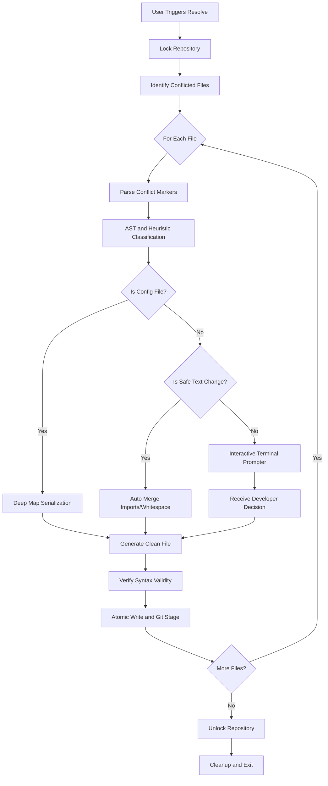

# gitresolve
<p align="center">
  
</p>

A locally executed Git merge conflict solver built with support for structured data and syntax-aware analysis.

Standard Git merge operations perform line-based text integration. `gitresolve` classifies conflicts into deterministic categories and applies specific merging strategies for configuration files and code structures.

## Installation

### Via Go Toolchain
```bash
go install github.com/jhanvi857/gitresolve@latest
```

### From Source
```bash
git clone https://github.com/jhanvi857/gitresolve.git
cd gitresolve
go build -o gitresolve ./cmd/gitresolve
# Move the binary to your executable path
mv gitresolve /usr/local/bin/
```

## Quick Start Setup

### 1. Integration with Git
To use `gitresolve` as your default resolution tool after a failed merge:

```bash
# View current conflicts
gitresolve status

# Start interactive resolution
gitresolve resolve
```

### 2. Pre-merge Scanning
To predict conflicts before running a destructive merge operation:

```bash
gitresolve scan --target main
```

### 3. Automated Environments (CI)
Integrate `gitresolve` into your CI/CD pipelines to catch unresolvable conflicts early:

```bash
# In your CI script (e.g., GitHub Actions)
gitresolve resolve --non-interactive --timeout 1m
```

---

## Core Features

### 1. Abstract Syntax Tree (AST) Intelligence
Instead of analyzing raw text, `gitresolve` integrates `go-tree-sitter` to compile conflicting blocks into syntax trees. This allows high-accuracy detection of function signature modifications and logical refactors in Go, JavaScript, and TypeScript.

### 2. Structured Data Auto-merger
Performs deep recursive map merges for JSON, YAML, and TOML using language-native parsers. Includes conservative array unioning to prevent silent data corruption and restricts auto-resolution for critical dependency files like package.json or go.mod.

### 3. Safety-First Execution Profile
* **Atomic Writes**: Uses temporary files and pointer swaps to prevent file corruption.
* **State Backups**: Creates temporary `<file>.gitresolve-orig` copies before any modifications.
* **Multi-layer Locking**: Prevents parallel execution using PID-verified file locks.

---

## Robust Testing Framework

`gitresolve` includes a production-grade testing ecosystem designed to validate conflict resolution accuracy across four distinct severity levels.

### Tiered Test Suite

1. **Level 1 (Easy)**: Validates whitespace changes, identical dual-sided modifications, and Go import deduplication.
2. **Level 2 (Medium)**: Tests JSON deep object merging, YAML array overlaps, and `go.mod` require block conflicts.
3. **Level 3 (Hard)**: Resolves complex `package.json` script updates, delete vs modify conflicts, and multi-file batch resolutions.
4. **Level 4 (Severe)**: Stress tests AST parsing resilience, concurrent lock contention, and database migration file consistency.

### Testing Workflow
The project utilizes a dedicated Python-based conflict generator and a PowerShell-driven test runner to ensure environment consistency.

```mermaid
graph LR
    Generator[Conflict Generator] --> |Creates| Fixtures[Test Fixtures]
    Fixtures --> |Input| Runner[Test Runner]
    Runner --> |Executes| Binary[gitresolve Binary]
    Binary --> |Produces| Result[Resolution Output]
    Result --> |Validated by| Checker[Syntax & Marker Check]
    Checker --> |Generates| Report[JUnit/Markdown Report]
```



---

## Advanced Features

### 1. Diagnostic Conflict Pattern Detection
Analyze the root cause of friction in your repository. By tracking history, identify the most common conflict types (e.g. Scalar 42%, Signature 15%), helping teams optimize their branching policies.

### 2. Tiered Interaction Model (Scalar UX)
The interactive prompter adapts to the complexity of the conflict. For minor single-line changes (TypeScalar), it provides a concise one-line comparison instead of the standard side-by-side block, reducing developer cognitive load.

### 3. CI and Automated Environment Interop
Specifically designed for automated pipelines with `--non-interactive` (exits with status 1 on manual requirements) and `--timeout` flags (auto-selects their-side resolution after a set duration).

### 4. Syntax-Aware Readiness Validation
After resolution, the engine optionally verifies the file's syntax validity. If the resolution breaks the code structure, the merge is halted immediately.

---

## Architectural Workflow

The operational flow prioritizes safety, executing natively without external API dependencies.



---

## Command Reference

| Command | Description |
| :--- | :--- |
| `gitresolve resolve` | Resolves remaining conflicts interactively or via automation. |
| `gitresolve resolve --non-interactive` | Fails on manual resolution requirements; suitable for CI pipelines. |
| `gitresolve resolve --strategy <ours/theirs/both>` | Applies a specific strategy to all remaining automated conflicts. |
| `gitresolve resolve --timeout <duration>`| Auto-selects their-side resolution after timeout (e.g. 30s). |
| `gitresolve resolve --dry-run` | Shows what would happen without writing any file or acquiring the lock. |
| `gitresolve scan --target <branch>` | Predicts conflicts against a target branch using modern git merge-tree. |
| `gitresolve status` | Displays block-level severity and auto-resolution status. |
| `gitresolve blame` | Shows resolution history for audits. |
| `gitresolve blame --patterns` | Displays conflict pattern analysis for diagnostic metrics. |
| `gitresolve undo --steps N` | Resets the repository to a recorded snapshot SHA from recent sessions. |

## Reliability and Safety
Each operation is protected by a multi-layered locking system using PID verification. Atomic writes and original file backups ensure the repository state can be recovered from any interrupted session. All history is stored in a local SQLite database capped at 1000 records to maintain performance.

## Recent Updates (April 2026)

### 1. Symmetric Brace Recovery for Malformed Conflict Markers
Conflict parsing now handles malformed Git marker output on both sides of a block:

1. **THEIRS trailing token recovery**: after `>>>>>>>`, if THEIRS brace depth is still open, parser consumes following lines into THEIRS until depth balances.
2. **OURS trailing token recovery**: after reading `=======`, if OURS is still open and the line immediately before `<<<<<<<` is a standalone `}` (or whitespace + `}`), that line is moved from pre-block lines into OURS.

### 2. Safe `[B]oth` Reconstruction for Asymmetric Blocks
When selecting `both`, if either side remains brace-unbalanced after recovery, `gitresolve` no longer errors immediately. It reconstructs a syntactically complete merge by:

1. taking OURS as-is,
2. appending `}` if OURS remains open,
3. inserting a blank separator line,
4. taking THEIRS as-is,
5. appending `}` if THEIRS remains open.

### 3. Pre-write Full-file Go Syntax Validation
Before writing reconstructed `.go` output, the resolver validates the complete file using Go parser checks. If validation fails, write is skipped and conflict handling escalates to manual with reason:

`reconstructed output failed Go syntax validation`

### 4. Fixture Isolation for Standard Go Verification
Go fixture files under `tests/` that intentionally contain invalid or non-buildable code are now tagged with:

`//go:build ignore`

This keeps fixture content available for byte-level test inputs while preventing those files from breaking standard repository checks such as `go build ./...`, `go vet ./...`, and `go test ./...`.

### 5. Decision Observability and Stable Reason Codes
Conflict escalation now includes machine-readable reason codes with a stable, additive contract (namespaced values such as `parser.*`, `semantic.*`, `strategy.*`, `validation.*`).

The resolver persists structured decision events to local SQLite (`decision_logs`) so teams can audit:

1. conflict type and severity,
2. selected action (`auto-resolve`, `manual-escalate`, `shadow-diff`, etc.),
3. reason code and human-readable reason,
4. confidence and operation context.

### 6. Shadow Mode with Hash-based Diff Recording
Both `resolve` and `merge` now support simulation mode via:

`--shadow`

In shadow mode, no file write occurs. Instead, the engine records deterministic before/after content hashes (original vs simulated output) to estimate blast radius safely before enforcement.

### 7. Release Gates for Operational Safety
For policy-controlled environments, commands support:

1. `--enforce-gates`
2. `--manual-rate-gate <percent>`

Current hard safety gate remains active: validation failures cause non-zero exit. Optional manual escalation-rate gating can now fail runs when operational thresholds are exceeded.

### 8. Capability-aware Semantic Guarding
Semantic handling is now gated by parser capability availability, not extension label alone. If semantic parsing support is unavailable in the current runtime, the conflict is escalated with an explicit reason code (`semantic.parse_failed`) rather than attempting unsafe logic.

### 9. Hardening Test Expansion
The test suite now includes additional safety-oriented coverage:

1. **Fuzz oracle tests** for parser/resolution invariants and corruption guards.
2. **Idempotency tests** to ensure repeated resolution is stable.
3. **Strategy consistency tests** to prevent cross-strategy contamination.
4. **Corpus deduplication tests** using normalized conflict fingerprints to keep large real-world corpora efficient and signal-rich.
