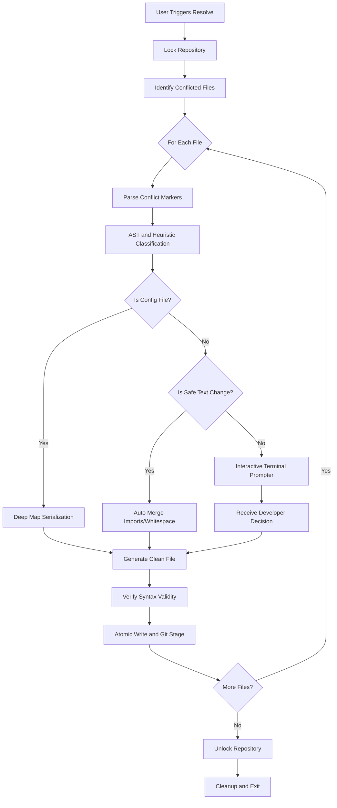

# gitresolve

A locally executed Git merge conflict solver built with support for structured data and syntax-aware analysis.

Standard Git merge operations perform line-based text integration. `gitresolve` classifies conflicts into deterministic categories and applies specific merging strategies for configuration files and code structures.

## Core Features

### 1. Abstract Syntax Tree (AST) Intelligence
Instead of analyzing raw text, `gitresolve` integrates `go-tree-sitter` to compile conflicting blocks into syntax trees. This allows high-accuracy detection of function signature modifications and logical refactors in Go, JavaScript, and TypeScript.

### 2. Structured Data Auto-merger
Performs deep recursive map merges for JSON, YAML, and TOML using language-native parsers. Includes conservative array unioning to prevent silent data corruption and restricts auto-resolution for critical dependency files like package.json or go.mod.

### 3. Safety-First Execution Profile
* **Atomic Writes**: Uses temporary files and pointer swaps to prevent file corruption.
* **State Backups**: Creates temporary <file>.gitresolve-orig copies before any modifications.
* **Multi-layer Locking**: Prevents parallel execution using PID-verified file locks.

---

## Special Unique Features

### 1. Diagnostic Conflict Pattern Detection
Unlike standard merge tools, `gitresolve` analyzes the root cause of friction in your repository. By tracking history, it identifies the most common conflict types (e.g., Scalar 42 percent, Signature 15 percent), helping teams identify where their branching policy is causing the most friction.

### 2. Tiered Interaction Model (Scalar UX)
The interactive prompter adapts to the complexity of the conflict. For minor single-line changes (TypeScalar), it provides a concise one-line comparison instead of the standard side-by-side block, significantly reducing developer cognitive load for trivial edits.

### 3. CI and Automated Environment Interop
Specifically designed for automated pipelines with --non-interactive (exits with status 1 on manual requirements) and --timeout flags (auto-selects their-side resolution after a set duration).

### 4. Syntax-Aware Readiness Validation
After resolution, the engine optionally verifies the file's syntax validity. If the resolution breaks the code structure, the merge is halted immediately.

---

## Architectural Workflow

The operational flow prioritizes safety, executing natively without external API dependencies.



---

## Command Reference

| Command | Description |
| :--- | :--- |
| `gitresolve resolve` | Resolves remaining conflicts interactively or via automation. |
| `gitresolve resolve --non-interactive` | Fails on manual resolution requirements; suitable for CI pipelines. |
| `gitresolve resolve --timeout <duration>`| Auto-selects their-side resolution after timeout (e.g. 30s). |
| `gitresolve resolve --dry-run` | Shows what would happen without writing any file or acquiring the lock. |
| `gitresolve scan --target <branch>` | Predicts conflicts against a target branch using modern git merge-tree. |
| `gitresolve status` | Displays block-level severity and auto-resolution status. |
| `gitresolve blame` | Shows resolution history for audits. |
| `gitresolve blame --patterns` | Displays conflict pattern analysis for diagnostic metrics. |
| `gitresolve undo --steps N` | Resets the repository to a recorded snapshot SHA from recent sessions. |

## Installation

```bash
go install github.com/jhanvi857/gitresolve@latest
```
