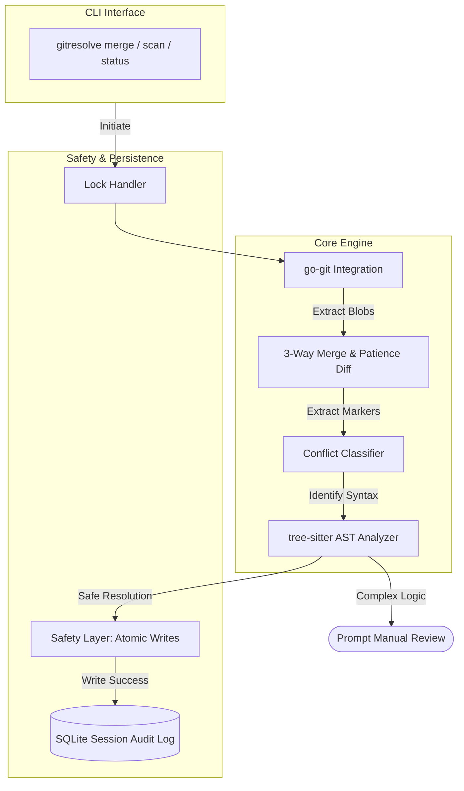

# gitresolve

A deterministic, privacy-first Git conflict resolution engine operating strictly without external dependencies or LLMs.

The gitresolve engine intercepts merge conflicts at the structural level using Abstract Syntax Tree (AST) analysis. By treating code as parsed structures rather than plain text diffs, it safely auto-resolves tedious formatting and structural conflicts natively, protecting the project from semantic breakage across divergent branches.

It runs purely on the local machine, enforcing enterprise compliance protocols automatically while bypassing the security vulnerabilities and hallucinations posed by external probabilistic models.

---

## Architecture and End-to-End Pipeline

gitresolve handles the lifecycle of a complex merge conflict through a mathematically strict progression. The resolution framework is isolated into bounded contexts to prevent data loss or silent logic corruption.

### End-to-End Resolution Process

Repository State -> go-git Indexer -> Conflict Parser -> AST Classifier -> Resolution Engine -> Safety Layer -> Atomic File System -> SQLite Audit Log

1. Repository State -> The engine locks the .git directory locally.
2. go-git Indexer -> Queries the git staging API to extract base, ours, and theirs blob contents from unmerged entries.
3. Conflict Parser -> Dissects standard Git artifact markers (<<<<<<<, =======, >>>>>>>) into distinct Conflict objects.
4. AST Classifier -> Analyzes each object using tree-sitter, scoring it based on syntactic severity and structural overlap.
5. Resolution Engine -> If proven deterministic (whitespace, imports, configuration keys), it compiles the merged payload. If the conflict involves overlapping complex logic, it applies a SeverityCritical flag and delegates to manual review.
6. Safety Layer -> Creates an exact backup of the original conflicted file under the .gitresolve-orig extension.
7. Atomic File System -> Streams resolved payloads to a temporary block, validates fsync, and executes os.Rename to safely replace the original file pointer without mid-write structural corruption.
8. SQLite Audit Log -> Commits the metadata resolution event to the local database mapping for post-merge blame or snapshot undo requirements.



---

## Deterministic Algorithms

Git's native Myers-diff algorithm treats conflicts sequentially and visually. gitresolve deploys structural algorithmic reasoning. When the engine encounters a conflict via `gitresolve merge`, it executes priority-tiered rules:

1. Format and Whitespace Syncing: Strips formatting discrepancies in the AST to safely auto-resolve without manual developer intervention.
2. Import Deduplication: Analyzes and deduplicates top-level import statement blocks independently.
3. Structured Configurations (JSON, YAML, TOML): Parses nested blocks as structured mapped data, successfully tracking and merging non-overlapping key derivations natively.
4. Logic Protection: Triggers escalation for deep mutations within highly sensitive domains (e.g. auth/, payments/, migrations/), halting deterministic execution and returning a SeverityCritical priority alert to the interface.

Before saving any auto-resolution, the verification pipeline audits the final string explicitly for dangling artifact markers and unmatched braces.

---

## Installation

Install pre-compiled binaries via the Go toolchain:
```bash
go install github.com/jhanvi857/gitresolve@latest
```
Or clone and compile locally:
```bash
git clone https://github.com/jhanvi857/gitresolve
cd gitresolve
go build -o bin/gitresolve main.go
```

---

## Commands

```bash
gitresolve status                 # Inspect severity scores on unresolved conflicts
gitresolve scan --target main     # Predict active conflict overlap before you push
gitresolve merge                  # Engage the auto-resolver engine locally
gitresolve merge --dry-run        # Preview intelligent merges securely 
gitresolve undo --steps 1         # Session replay snapshot reversion
```

---

## Configuration

Initialize optional team boundaries securely in `.gitresolve/owners.json` to configure localized pre-push alerts for ownership mapping.

```json
{
  "backend": ["internal/**", "pkg/**"],
  "frontend": ["web/**"]
}
```