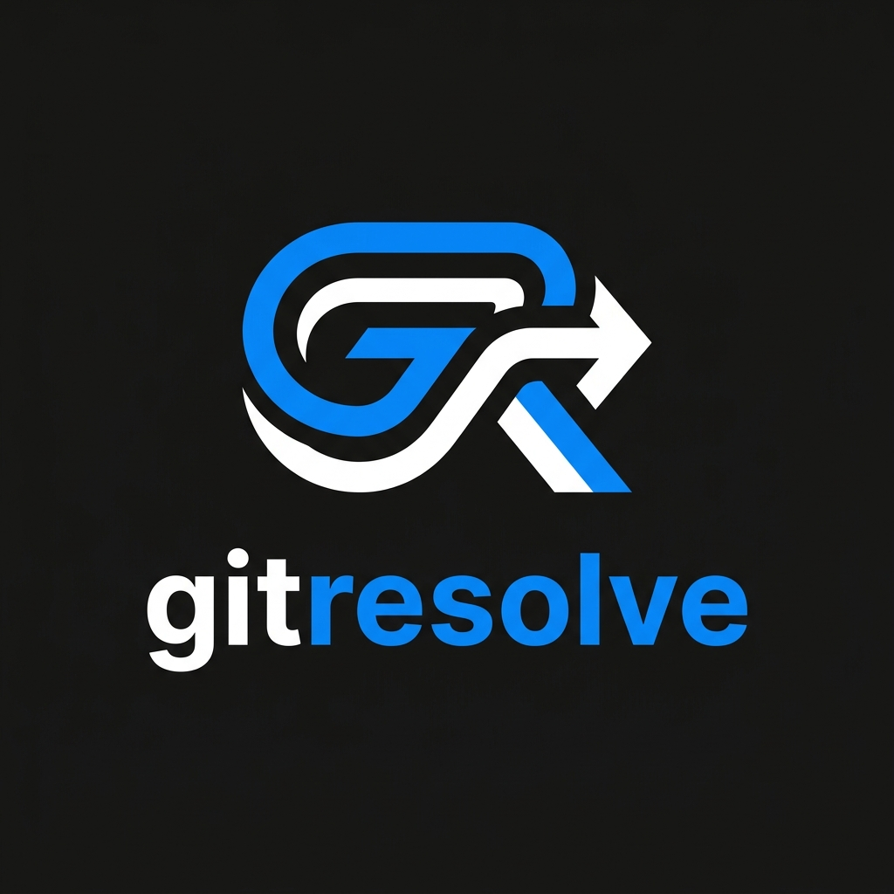
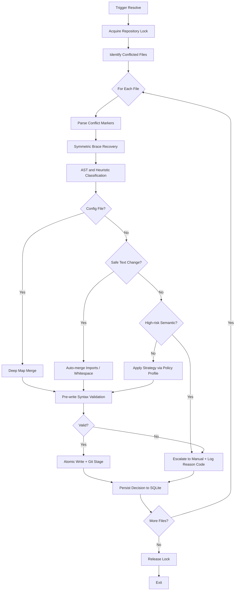

# gitresolve

<p align="center">
  
</p>

<p align="center">
  <a href="https://github.com/jhanvi857/gitresolve/actions/workflows/ci.yml"></a>
  <a href="go.mod"></a>
  <a href="LICENSE"></a>
</p>

A locally executed, safety-first Git merge conflict resolver with syntax-aware classification, structured data merging, and full decision auditability.

Standard Git merge operations perform line-based text integration. `gitresolve` classifies conflicts into deterministic categories, applies targeted resolution strategies per conflict type, and escalates to manual review when automated resolution would be unsafe. Every decision is logged, queryable, and CI-gateable.

---

## Table of Contents

- [Installation](#installation)
- [Quick Start](#quick-start)
- [Core Features](#core-features)
- [Command Reference](#command-reference)
- [Policy Profiles](#policy-profiles)
- [Observability and Stats](#observability-and-stats)
- [CI Integration](#ci-integration)
- [Architecture](#architecture)
- [Testing](#testing)
- [Security](#security)
- [Evidence and Limitations](#evidence-and-limitations)
- [Readiness Gates](#readiness-gates)
- [Comparative Positioning](#comparative-positioning)

---

## Installation

### Via Go Toolchain

```bash
go install github.com/jhanvi857/gitresolve@latest
```

### From Source

```bash
git clone https://github.com/jhanvi857/gitresolve.git
cd gitresolve
go build -o gitresolve ./cmd/gitresolve
mv gitresolve /usr/local/bin/
```

---

## Quick Start

### Build from source

```bash
git clone https://github.com/jhanvi857/gitresolve.git
cd gitresolve
make build
./bin/gitresolve --help
```

### Run tests

```bash
make test
```

### Usage examples

```bash
# View current conflicts with block-level severity
gitresolve status

# Resolve interactively
gitresolve resolve

# Predict conflicts before a destructive merge
gitresolve scan --target main

# Simulate decisions without writing any files
gitresolve resolve --shadow

# Run in CI with non-interactive mode
gitresolve resolve --non-interactive --timeout 1m
```

---

## Core Features

### Safety-First Execution

Every write operation is protected by **atomic file swaps**, **os.Root sandboxing (CWE-22 mitigation)**, **OS-native advisory locking**, and pre-write syntax validation. If Go output validation fails, the write is skipped and the conflict escalates to manual review. The tool implements a mandatory **10MB file size gate** to prevent resource exhaustion (DoS) attacks.

### AST-Based Classification

`gitresolve` integrates `go-tree-sitter` to compile conflicting blocks into syntax trees rather than operating on raw text. This enables accurate detection of function signature modifications, struct field conflicts, and logical refactors across Go, JavaScript, and TypeScript.

### Structured Data Merging

Deep recursive map merges for JSON, YAML, and TOML files using language-native parsers. Includes conservative array unioning to prevent silent data corruption. Auto-resolution is restricted for critical dependency files such as `package.json` and `go.mod`.

### Decision Auditability

Every conflict decision is persisted to a local SQLite database with a stable, namespaced reason code (`parser.*`, `semantic.*`, `strategy.*`, `validation.*`). The decision log records conflict type, selected action, confidence level, and operation context. This makes every resolution auditable and retrospectively analyzable.

### Shadow Mode

Run `--shadow` to simulate the full resolution pipeline without writing any files. Before-and-after content hashes are recorded so you can measure blast radius before enforcing automation.

### Policy Profiles

Resolution risk posture is configurable per command, per path, and per team via `.gitresolve/policy.json`. Profiles range from `strict` (maximum escalation, minimum risk) to `aggressive` (maximum automation for low-risk paths).

---

## Command Reference

| Command | Description |
| :--- | :--- |
| `gitresolve resolve` | Resolve conflicts interactively or via automation. |
| `gitresolve resolve --non-interactive` | Exit with status 1 on any manual resolution requirement. Suitable for CI. |
| `gitresolve resolve --strategy <ours/theirs/both>` | Apply a fixed strategy to all automatable conflicts. |
| `gitresolve resolve --policy-profile <auto/strict/balanced/aggressive>` | Apply a risk posture by explicit profile or by `.gitresolve/policy.json` path mapping when set to `auto`. |
| `gitresolve resolve --dry-run` | Preview decisions without writing files or acquiring the repository lock. |
| `gitresolve resolve --shadow` | Simulate decisions and record hash-only before/after diffs without writing files. |
| `gitresolve resolve --timeout <duration>` | On prompt timeout, emits an explicit warning and auto-selects their-side resolution (e.g. `30s`). |
| `gitresolve resolve --enforce-gates --manual-rate-gate <percent>` | Fail the run if the manual escalation rate exceeds the specified threshold. |
| `gitresolve scan --target <branch>` | Predict conflicts against a target branch using `git merge-tree`. |
| `gitresolve merge --policy-profile <profile>` | Apply policy-based auto-resolution posture during merge execution. |
| `gitresolve stats` | Report decision metrics and top reason codes from local observability logs. |
| `gitresolve stats --operation <all/resolve/merge>` | Filter stats by operation type. |
| `gitresolve stats --json` | Emit stats as JSON for CI consumption. |
| `gitresolve stats --top <N>` | Show the top N escalation reason codes. |
| `gitresolve status` | Display block-level conflict severity and auto-resolution status per file. |
| `gitresolve blame` | Show resolution history for audits. |
| `gitresolve blame --patterns` | Display conflict pattern frequency analysis. |
| `gitresolve undo --steps <N>` | Reset the repository to a recorded snapshot SHA from a recent session. |
| `gitresolve resolve --max-file-bytes <bytes>` | Skip files larger than this limit (default 10MB). Set to -1 for unlimited. |
| `gitresolve resolve --log-level <level>` | Set log level: error, warn, info, debug, trace (default: warn). |
| `-v`, `--verbose` | Shorthand for `--log-level info`. |

---

## Policy Profiles

Policy profiles tune resolution risk posture per team and per path without requiring per-command flags.

| Profile | Behavior |
| :--- | :--- |
| `strict` | Maximum escalation. Blocks `Both` for all source files. Suitable for critical paths (auth, payments, migrations). |
| `balanced` | Default posture. Escalates on type conflicts and unbalanced struct changes. |
| `aggressive` | Maximum automation. Suitable for generated code, documentation, or low-risk paths. |
| `auto` | Resolved from `.gitresolve/policy.json` by longest path match, then team ownership, then default. |

### Configuration Example

Create `.gitresolve/policy.json` at the repository root:

```json
{
  "default": "balanced",
  "path_profiles": {
    "internal/auth/": "strict",
    "internal/payments/": "strict",
    "docs/": "aggressive"
  },
  "team_profiles": {
    "security": "strict",
    "frontend": "aggressive"
  }
}
```

To preview which profile applies to a given file:

```bash
gitresolve resolve --policy-profile auto --dry-run internal/auth/handler.go
```

---

## Observability and Stats

All decisions are stored in a local SQLite database. Conflict history retention defaults to 1000 records per repository and is configurable via environment variables documented below. Query stats at any time:

```bash
gitresolve stats --json
```

Example output:

```json
{
  "total_decisions": 47,
  "auto_resolved": 31,
  "escalated_to_manual": 16,
  "escalation_rate": 0.34,
  "top_escalation_reasons": [
    { "reason": "semantic.field_type_conflict", "count": 9 },
    { "reason": "validation.go_syntax_failed", "count": 4 },
    { "reason": "parser.malformed_marker", "count": 3 }
  ]
}
```

Reason codes follow a stable, additive contract. Existing codes are never renamed or removed between releases. New codes are added under existing namespaces:

- `parser.*` for marker-level parsing failures
- `semantic.*` for type, field, or signature conflicts
- `strategy.*` for policy and strategy enforcement decisions
- `validation.*` for pre-write syntax and structural validation failures

### Operational Environment Variables

- `GITRESOLVE_DB_PATH`: Override the SQLite DB location. Absolute paths are used directly; relative paths are resolved from repo root.
- `GITRESOLVE_DB_CONFLICT_CAP`: Per-repo conflict retention cap. Default `1000`. Set to `0` to disable pruning.

---

## CI Integration

### Non-Interactive Mode

```bash
gitresolve resolve --non-interactive --timeout 1m
```

Exits with status 1 if any conflict requires manual resolution, making it safe to use as a pipeline gate.

### Escalation Rate Gating

Fail a CI job if manual escalation exceeds a defined threshold:

```bash
gitresolve resolve --enforce-gates --manual-rate-gate 30
```

Or query the stats output directly:

```bash
gitresolve stats --json | jq 'if .escalation_rate > 0.4 then error("escalation rate too high") else . end'
```

### GitHub Actions Example

```yaml
- name: Resolve merge conflicts
  run: |
    gitresolve resolve --non-interactive --policy-profile auto --timeout 2m

- name: Check escalation rate
  run: |
    gitresolve stats --json | jq 'if .escalation_rate > 0.35 then error("manual escalation rate exceeded threshold") else . end'
```

---

## Architecture

The resolution pipeline executes locally with no external API dependencies.



---

## Testing

### Tiered Test Suite

The test suite validates resolution accuracy across four severity levels:

| Level | Coverage |
| :--- | :--- |
| 1 - Easy | Whitespace normalization, identical dual-sided modifications, Go import deduplication. |
| 2 - Medium | JSON deep object merging, YAML array overlaps, `go.mod` require block conflicts. |
| 3 - Hard | Complex `package.json` script updates, delete-vs-modify conflicts, multi-file batch resolution. |
| 4 - Severe | AST parsing resilience under malformed input, concurrent lock contention, database migration file consistency. |

### Safety-Oriented Coverage

Beyond functional correctness, the suite includes:

- **Fuzz testing** for the conflict parser to catch edge-case malformations.
- **Fuzz oracle tests** for resolution invariants and corruption guards.
- **Idempotency tests** to ensure repeated resolution runs produce identical output.
- **Strategy consistency tests** to prevent cross-strategy contamination.
- **Corpus deduplication tests** using normalized conflict fingerprints to keep real-world regression sets efficient and signal-rich.
- **Regression coverage** for malformed marker behavior, brace recovery paths, and high-risk `Both` blocking.

```bash
go test ./...
```

### Test Organization

- **Unit tests** (`*_test.go` files): Located alongside source code in `cmd/`, `internal/`, and `pkg/` directories.
- **Integration tests**: Located in the `tests/` directory, with fixtures in `tests/testdata/` and infrastructure in `tests/integration/`.
- **Test results**: See [test_suite_report.md](documentation/test_suite_report.md) for detailed validation results.

---

## Security

`gitresolve` is built for high-security environments:

- **Path Traversal (CWE-22)**: Mandates `os.Root` sandboxing for all file operations.
- **Resource Exhaustion (DoS)**: 10MB default file size gate prevents memory exhaustion.
- **Advisory Locking**: Native `flock(2)`/`LockFileEx` to prevent races and PID-reuse attacks.
- **Privacy**: Sensitive content is cryptographically hashed (SHA-256) in logs.
- **Verifiable Releases**: Signed with Cosign (OIDC), CycloneDX SBOMs included.

**Validation Evidence**: Real-world evidence from resolver validation across open-source projects is available in [documentation/EVIDENCE.md](documentation/EVIDENCE.md).

---

## Evidence and Limitations

`gitresolve` is currently best described as an early-beta, safety-oriented resolver with production-grade architectural direction.

### What the tool does well

- Applies deterministic processing pipelines for known conflict classes: classification, strategy selection, pre-write verification.
- Uses full-file Go syntax validation before any write operation.
- Provides explicit manual escalation paths with machine-readable reason codes rather than forcing risky auto-resolution.
- Records structured decision telemetry for auditability, pattern analysis, and iterative hardening.

### Current limitations

- Semantic correctness is not guaranteed even when syntax validation passes. Passing compilation is a necessary but not sufficient condition for correctness.
- AST and parser capability is language- and environment-dependent. Go has the deepest syntax validation path today; JS/TS flows rely on conservative classifier and structural fallbacks where full semantic certainty is unavailable.
- Heuristic recovery paths for malformed markers prioritize safe fallback and may still require manual review.
- Real-world robustness is dependent on repository style, language mix, and conflict shape diversity. Published metrics will be added as corpus coverage grows.

### Malformed Marker Resilience

Malformed or nested conflict markers are treated as high-risk inputs. The parser marks them with stable reason codes and the resolver escalates to manual handling if safe deterministic reconstruction cannot be guaranteed.

### Recommended usage posture

- Treat auto-resolution as an acceleration layer, not a replacement for developer review.
- Always run builds and tests after resolution in CI workflows.
- Use `--shadow` and decision logs to evaluate risk before enabling stricter enforcement gates.

---

## Readiness Gates

To move from early-beta toward production-grade confidence, use explicit measurable gates.

### Active operational gates

- Validation failures are hard-fail conditions with non-zero exit.
- Optional manual escalation-rate gating via `--enforce-gates` and `--manual-rate-gate <percent>`.

### Suggested release progression

| Gate | Condition |
| :--- | :--- |
| Beta | Validation failure rate is zero across sustained CI runs. |
| Release Candidate | Stable manual escalation rate trend over a defined observation window with no data-corruption incidents. |
| Production | Corpus coverage and regression targets met. Real-world resolution metrics published. |

---

## Comparative Positioning

`gitresolve` is positioned as a local-first, safety-oriented conflict resolution layer on top of standard Git workflows. It is not a visual merge tool and does not require an IDE or external AI API.

### Relative strengths

- Conservative escalation by default: prefers a logged escalation over a silent wrong resolution.
- Structured-data merge support across JSON, YAML, and TOML with conservative array handling.
- CI-oriented operational controls: `--non-interactive`, `--timeout`, `--shadow`, `--enforce-gates`.
- Full local execution with no network dependency or API key requirement.
- Built-in observability via decision logs, stable reason codes, and the `stats` command.

### Known tradeoffs

- Semantic strategies are intentionally conservative and will escalate more conflicts than tools that optimize for automation rate over safety.
- Language breadth is still evolving. Go support is the most mature.
- Some conflicts will remain manual by design. This is a feature, not a gap.

---

## License

See [LICENSE](LICENSE).