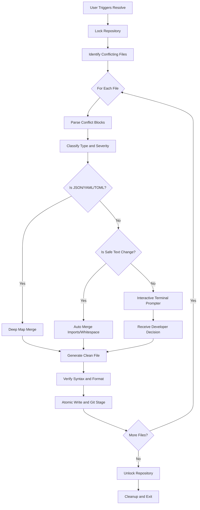

# gitresolve

gitresolve is a local Go CLI for handling Git merge conflicts with deterministic, rule-based logic and intelligent AST analysis.

## What It Does

*   Runs locally with no network or API calls.
*   Detects conflicted files from Git status using native diff processes.
*   Locks the repository root with `.gitresolve.lock` while running.
*   Safely unwraps inline conflict markers.
*   Classifies each conflict block contextually using Abstract Syntax Trees and structured heuristics.
*   Auto-resolves strictly safe categories (like structured data, imports, and whitespace).
*   Delegates complex logic to a built-in interactive terminal prompter.
*   Verifies resulting content (syntax checks and JSON/YAML/TOML validity).
*   Writes updates atomically and manages file staging automatically.

## Core Features

### 1. Abstract Syntax Tree Intelligence
gitresolve natively integrates go-tree-sitter to parse source files structurally rather than treating them as flat text. It accurately pinpoints function signature modifications and logical refactors in Go, JavaScript, and TypeScript. This prevents accidental syntax corruption during automated merges and accurately flags dangerous modifications.

### 2. Structured Data Auto-Merger
Conflicts occurring within configuration files (.json, .yaml, .yml, .toml) are completely auto-resolved. The engine cleanly unmarshals both divergent branches into data maps, performs a deep recursive merge, and safely reserializes the output to preserve exact syntactical validity without human intervention.

### 3. Interactive Prompter
When encountering highly critical conflicts (such as sensitive authentication path alterations, code deletions, or complex logic modifications), the engine strictly pauses operations. It isolates the conflict, renders a clean side-by-side terminal comparison, and blocks for explicit human input. Developers simply press `O`, `T`, or `B` to choose immediate resolutions in terminal.

## Workflow Overview



## Commands

*   `gitresolve resolve [--interactive]`
    Resolves remaining conflict blocks. Safe structural blocks are handled automatically, while complex algorithms trigger the interactive prompter. By default, it runs interactively.
*   `gitresolve merge [--dry-run]`
    Auto-resolves safe conflict blocks in existing conflicted files silently.
*   `gitresolve scan --target <branch>`
    Predicts conflict blocks against another branch using standard git tools before they occur.
*   `gitresolve status`
    Inspects current conflicted files and prints per-block severity, type, and auto-resolve status.
*   `gitresolve blame [--file <path>]`
    Displays stored conflict-resolution history logged in the SQLite database.
*   `gitresolve undo --steps N`
    Resets the repository to a recorded snapshot SHA from recent sessions.

## Conflict Classification Rules

*   TypeWhitespace: Auto-resolved (merges standard formatting differences).
*   TypeIdentical: Auto-resolved (deduplicates exact same changes).
*   TypeImport: Auto-resolved (deduplicates imports safely across languages).
*   TypeStructured: Auto-resolved (JSON/YAML/TOML configurations deep-merged).
*   TypeDeleteModify: Delegated to Interactive Prompt (high severity deletion protection).
*   TypeSignature: Delegated to Interactive Prompt (requires AST-level verification).
*   TypeLogic: Delegated to Interactive Prompt (core logic modifications or sensitive paths).

## Installation

```bash
go install github.com/jhanvi857/gitresolve@latest
```

Or build locally:

```bash
git clone https://github.com/jhanvi857/gitresolve
cd gitresolve
go build -o bin/gitresolve .
```

## Development Notes

*   Lock file path: `.gitresolve.lock` at repo root.
*   Backup convention: `<file>.gitresolve-orig`.
*   Atomic write strategy: temp file in same directory concatenated with `Sync` and `Rename`.
*   If no conflicted files are found, commands exit gracefully with an informative status message.